<p align="center">
  
</p>

<h3 align="center">Exhaustive search and quality control for EEGLAB preprocessing pipelines — ranked by <i>your</i> goal</h3>

<p align="center">
  <a href="https://github.com/abwoo/NeuroQC/stargazers"></a>
  <a href="https://github.com/abwoo/NeuroQC/commits/main"></a>
  <a href="https://github.com/abwoo/NeuroQC/actions/workflows/docs-links.yml"></a>
  
  
  
</p>

<p align="center">
  <b><a href="https://abwoo.github.io/NeuroQC/">🌐 Website</a></b> ·
  <b><a href="https://github.com/abwoo/NeuroQC/stargazers">⭐ Star</a></b>
</p>

<p align="center">
  <code>252 regression tests</code> ·
  <code>5 ranking objectives</code> ·
  <code>100% local</code> ·
  <code>0 network calls</code>
</p>

> ✅ **Source included — MIT license.** This repository ships the `neuroqc.*` toolbox
> source as an installable EEGLAB plugin, plus the documentation set, the default search-space
> configuration, reference examples and UI screenshots. The test suite, validation artifacts and
> research data are **not included**. Licensed under the MIT License — see
> [What's included](#whats-included).

---

## Why NeuroQC?

EEG preprocessing is a **discrete combination problem**: filters, epoch windows, artifact rules,
ICA policies, re-referencing — each has a handful of defensible values, and the number of pipelines
multiplies fast. Researchers typically fix one pipeline by hand, or write a script that tries two
variants and then argues which looks better.

NeuroQC takes a third route:

- **Search** the discrete space *exhaustively* (legally — respecting step order, dependencies and budgets).
- **Rank** every surviving pipeline against *your* goal (relevance, retention, distortion, SNR…) —
  Pareto front first, goal weights second.
- **Feedback** through external QC metrics you already produce in EEGLAB — recommendations are shown
  **only among evaluated candidates**, never invented.
- **Reproduce** each candidate as a standalone `recipe_E000001.m` script.

And it is emphatically **not AI**: no LLM, no API keys, no telemetry, no network calls.

## See it in action

<p align="center">
  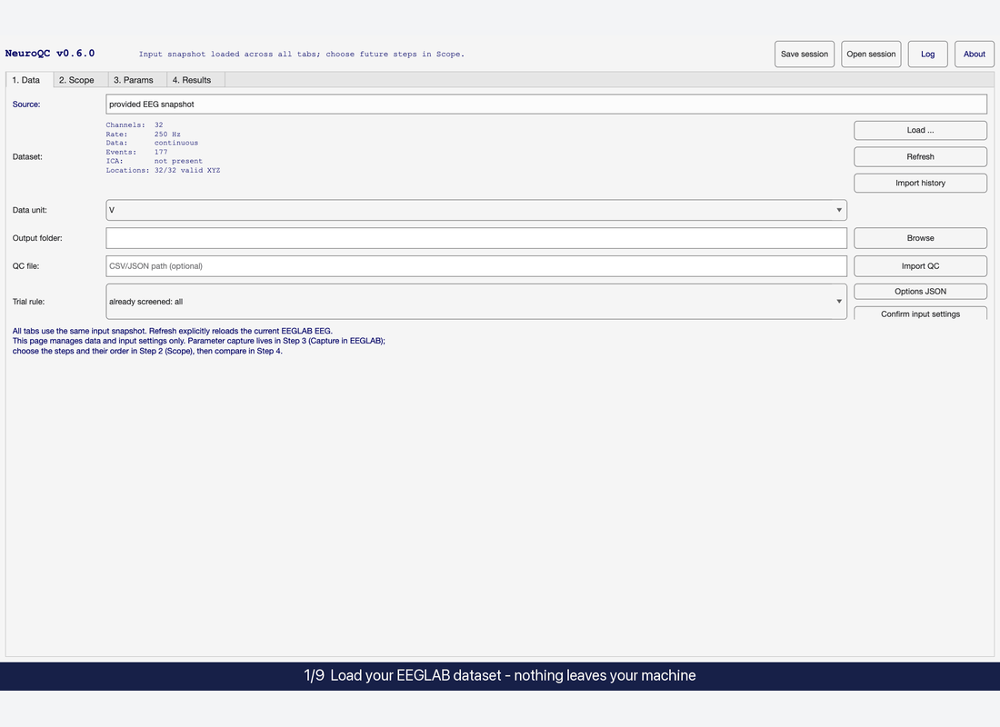
</p>

### One complete run, by the numbers

The GIF replays a full session on a synthetic 32-channel oddball dataset (200 s, 60 target /
120 standard trials). **Every number below was produced by the tool**, nothing is hand-typed:

<!-- sync:numbers:en -->
| Stage | What happened |
|---|---|
| **Preview** | 4 highpass × 2 lowpass → **8 combinations; 8 legal; 0 rejected** |
| **Log** | `filter > epoch` enumerated for every combination — `valid=8; invalid=0; duplicate=0` |
| **Generate** | **8 standalone recipe scripts** written, zero signal processing |
| **Compare all** | **8 / 8 evaluated (100%)**, 0 failures → status `REVIEW` |
| **Pareto front** | **6 of 8** survive the 5-objective front; 2 dominated candidates dropped |
| **Goal ranking** | `bestEvaluated` on the recommended row (best **E000003**), plus per-objective labels (`reliability`, `retention`, `topoStability`, `waveformDistortion`, `interpRatio`) |
| **Metrics** | Rel 0.829–0.849 · Reten 1.00 · Dist 0.416–0.445 (hard gate ≤ 0.50) |
| **QC import** | One click fills Rel / Reten / Dist / labels, Pareto front and `bestEvaluated` from your measured metrics — status `REVIEW` |
| **Goal switch** | Balanced (`1 1 1 1 1`) → best **E000008** (GoalScore 0.5230); Lower filter distortion (`2 0.5 0.5 3 0.5`) → best **flips to E000007** (0.4190) — same QC data, no re-measurement |
| **Drift gate** | One edit after generation → red `Required: Settings changed…`, Compare/Retry disabled |

**Manual workflow vs. NeuroQC on this exact run:** by hand you would normally settle on one
filter pair, run it, eyeball the ERP, maybe try one more — 1–2 pipelines at most, with no
record of what was skipped. NeuroQC enumerated **all 8**, executed **all 8 on copies**,
enforced the hard constraints, kept the Pareto-optimal **6**, and returned a ranked shortlist
in which every row is a reproducible script.
<!-- /sync:numbers:en -->

### Micro-demos

<table>
  <tr>
    <td width="50%">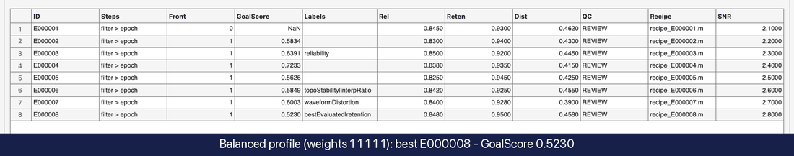<br/><sub><b>Goal switch</b> — re-rank without re-measuring anything</sub></td>
    <td width="50%">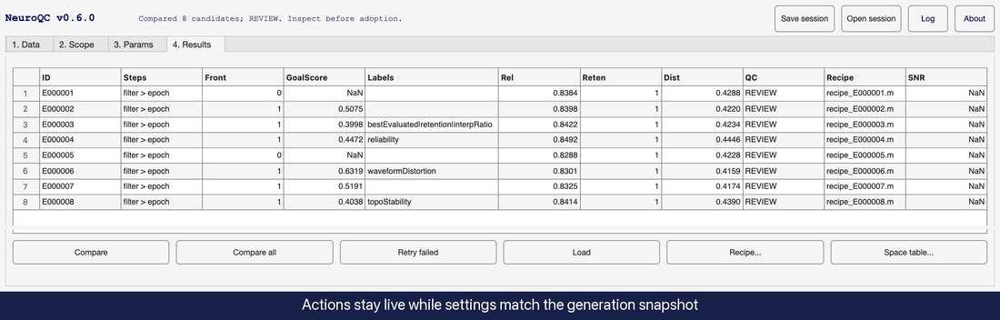<br/><sub><b>Drift gate</b> — stale recipes can never meet new settings</sub></td>
  </tr>
  <tr>
    <td width="50%">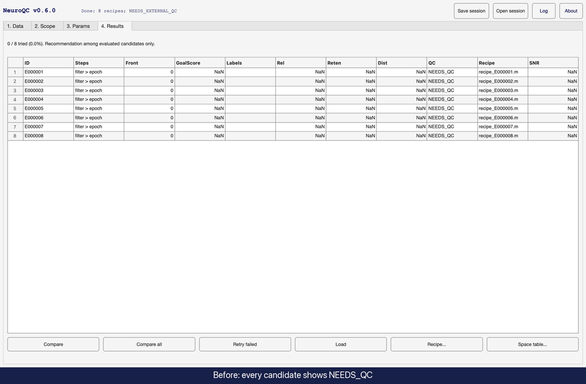<br/><sub><b>QC import</b> — your measured metrics drive the ranking</sub></td>
    <td width="50%">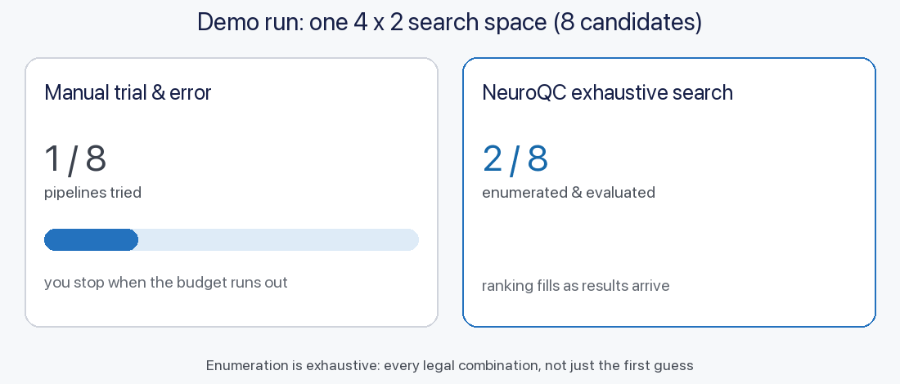<br/><sub><b>Manual vs NeuroQC</b> — 3 of 8 versus all 8, honestly</sub></td>
  </tr>
</table>

<details>
<summary>A real generated recipe — a standalone EEGLAB function (click to expand)</summary>

```matlab
function EEG = recipe_E000001(EEG)
% EEGLAB candidate: pass the original handoff EEG; output is a separate copy.
assert(strcmp(neuroqc.utils.hashEEG(EEG),'1b0abb70cd397131e8c4335fbc53a8c42b7ad5faf6e0c56065001f0a81c09ad1'),'NeuroQC:SourceMismatch','Use the original handoff dataset, not another candidate output');
opts=jsondecode('{"dataUnit":"V","trialSelection":{"mode":"all"},"codes":["s1002","s1001"],"trialSteps":true}');
EEG=neuroqc.advice.RecipeInput.prepare(EEG,opts);
badIdx=[];
if isfield(EEG.etc.neuroqc,'badChannels'), badIdx=EEG.etc.neuroqc.badChannels; end
EEG.etc.neuroqc.recipeId='E000001';

% step 1: filter
EEG = pop_eegfiltnew(EEG, 0.1, 20);
EEG = eeg_checkset(EEG);

% step 2: epoch
eventIdx=find(arrayfun(@(e) isequal(e.neuroqc_selected,1),EEG.event));
assert(~isempty(eventIdx),'NeuroQC:NoFormalTrials','No selected events remain');
EEG=pop_epoch(EEG,{},[-0.2 1],'eventindices',eventIdx,'epochinfo','yes');
EEG = eeg_checkset(EEG);

EEG.setname = [EEG.setname '_REVIEW'];
EEG.etc.neuroqc.status = 'REVIEW';
% Inspect continuous data, ICs, ERP, and rejected trials in EEGLAB before use.
end
```

</details>

<details>
<summary><b>Interface tour</b> — all four tabs, dialogs and gates (click to expand)</summary>

<table>
  <tr>
    <td width="50%">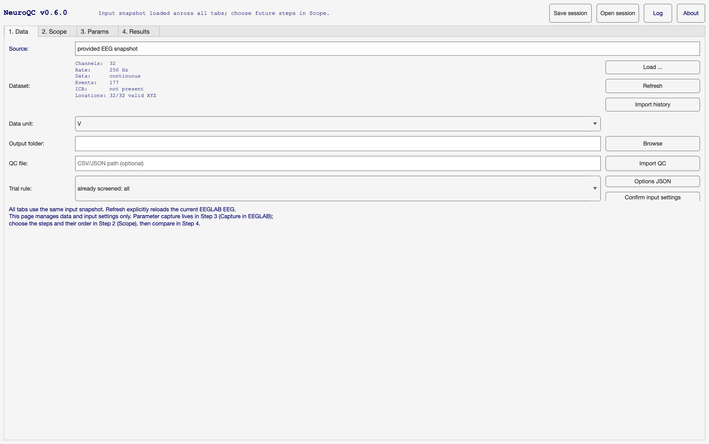<br/><sub><b>1. Data</b> — snapshot summary &amp; input settings</sub></td>
    <td width="50%">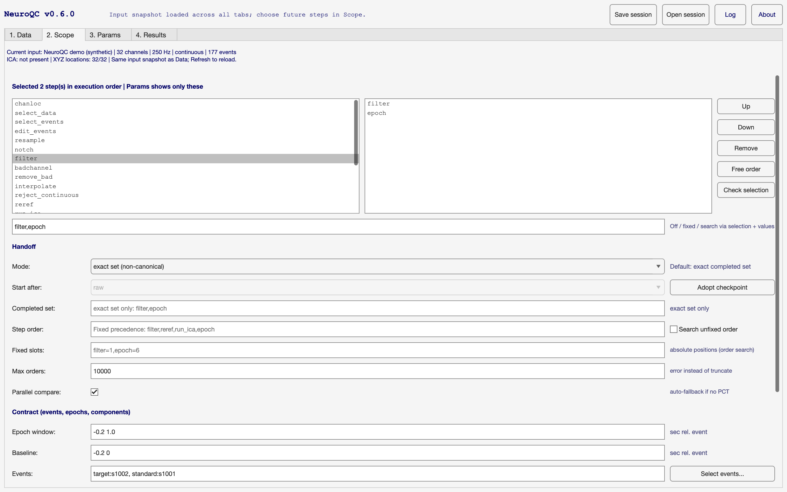<br/><sub><b>2. Scope</b> — steps, order, handoff, contract</sub></td>
  </tr>
  <tr>
    <td width="50%">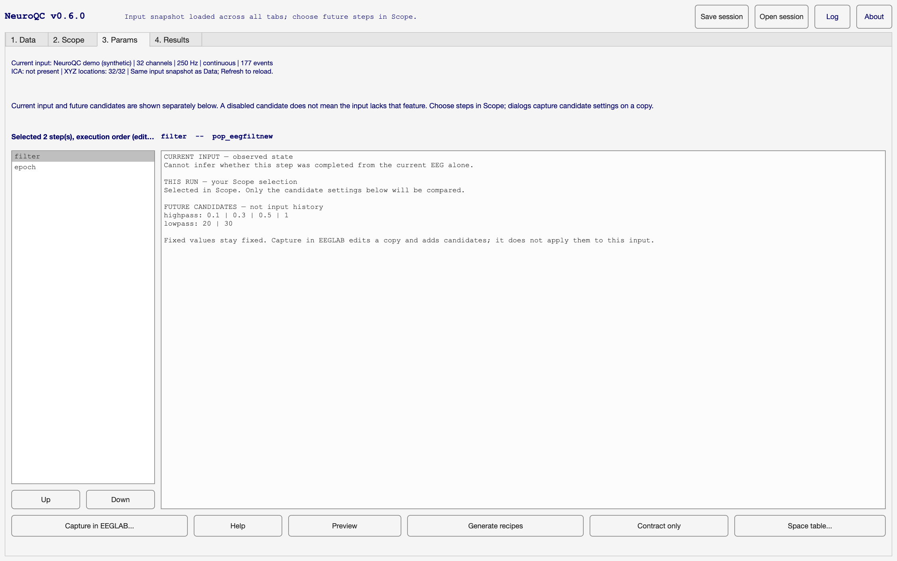<br/><sub><b>3. Params</b> — candidates per step</sub></td>
    <td width="50%">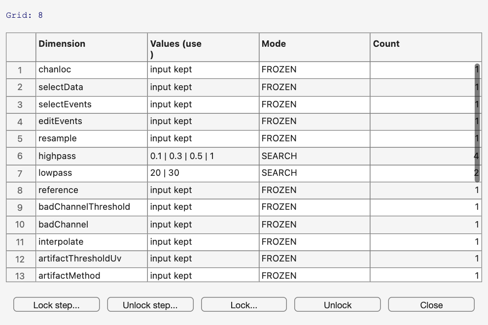<br/><sub><b>4. Search space</b> — every dimension, Grid: 8</sub></td>
  </tr>
  <tr>
    <td width="50%">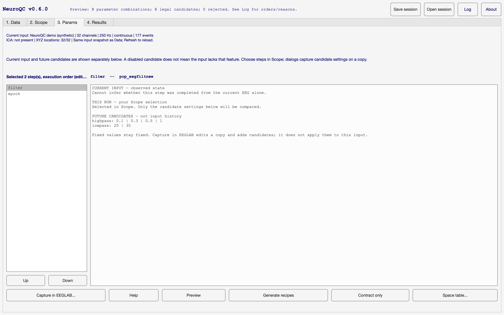<br/><sub><b>5. Preview</b> — counts before anything runs</sub></td>
    <td width="50%">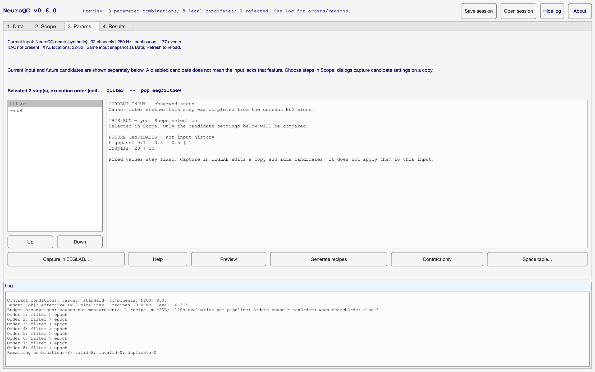<br/><sub><b>6. Log</b> — enumeration orders &amp; validity</sub></td>
  </tr>
  <tr>
    <td width="50%">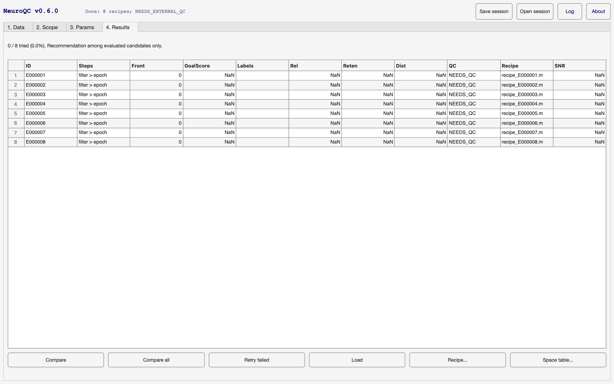<br/><sub><b>7. Generated</b> — 8 recipes, 0 / 8 tried</sub></td>
    <td width="50%">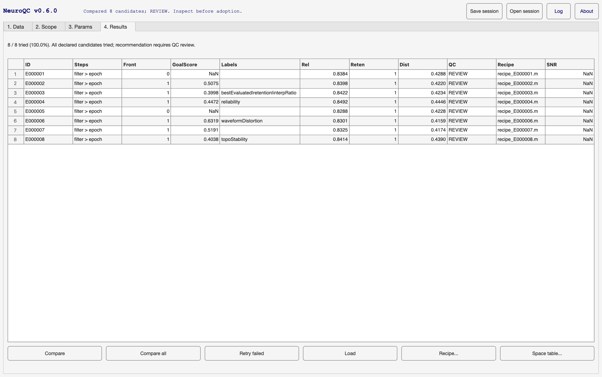<br/><sub><b>8. Evaluated</b> — 8 / 8 tried, front &amp; ranking filled</sub></td>
  </tr>
  <tr>
    <td width="50%">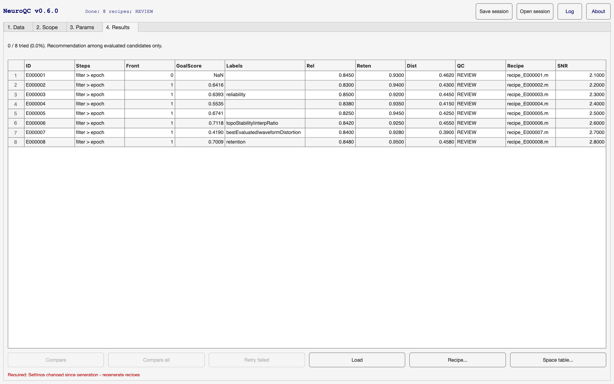<br/><sub><b>9. Drift gate</b> — edit after generation → actions locked</sub></td>
    <td width="50%">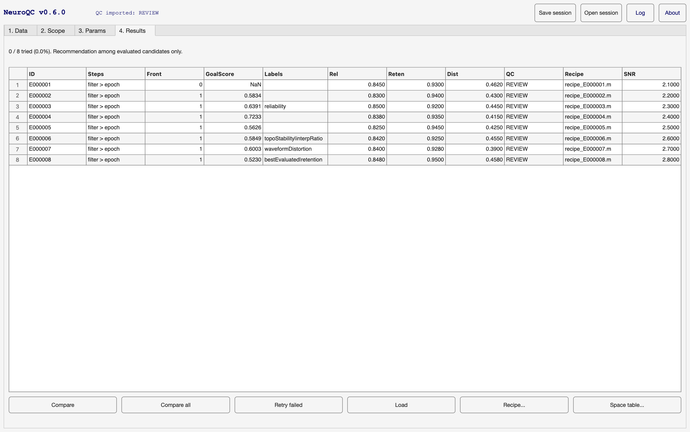<br/><sub><b>10. QC imported</b> — metrics, front &amp; best filled</sub></td>
  </tr>
  <tr>
    <td width="50%"><br/><sub><b>11. Re-ranked</b> — same data, new goal profile</sub></td>
  </tr>
</table>

</details>

> Screenshots are generated from a **synthetic** 32-channel EEG dataset — no real subject data
> appears anywhere in this repository.

## Highlights

| | |
|---|---|
| 🎯 **Goal-driven ranking** | Pareto front + weighted GoalRanker. Adjust goal weights and the ranking updates — no re-search. |
| 🔍 **Exhaustive discrete search** | Full combination enumeration with legality constraints, order search (fixed / free / slot-locked) and a budget guard that refuses silently-truncated sampling. |
| 🩺 **QC in the loop** | Import QC metrics (CSV/JSON) from EEGLAB; GoalScore and labels only ever reflect *evaluated* candidates. |
| 🛡️ **Config-drift gate** | Edit a setting after generating recipes and Results actions disable themselves with a red `Required: Settings changed since generation` hint — you can never compare stale recipes against new settings. Failed recipes get a gated **Retry**. |
| 🧩 **Analysis Contract** | Events, conditions, epoch/baseline windows and components-of-interest declared once, validated fail-closed before any search runs. |
| 🔄 **Handoff & resume** | Mark completed stages, resume from checkpoints, lock step order absolutely (`filter=1,epoch=6`) or search unfixed orders. |
| 📜 **Reproducible recipes** | Every candidate becomes a self-contained recipe script with its exact parameters — rerun or hand it to a collaborator. |
| 🖥️ **GUI + headless API** | A 4-tab EEGLAB wizard *and* a scriptable MATLAB API — the same engine drives both (the development test suite currently runs 252 regression tests against it). |

## How it works

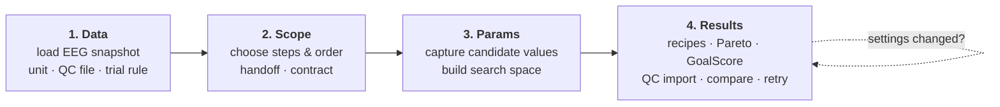

## Comparison

| | Manual trial-and-error | Fixed pipeline script | **NeuroQC** |
|---|:---:|:---:|:---:|
| Explores the combination space | a few variants | 1 | **exhaustive (budget-guarded)** |
| Ranks by *your* goal | gut feeling | maybe one metric | **Pareto + weighted GoalRanker** |
| Uses your QC metrics | notes in a lab book | ad hoc | **first-class QC import, evaluated-only** |
| Catches config/result mismatch | — | — | **config-drift gate + gated retry** |
| Reproducibility | remembered steps | the script itself | **per-candidate recipe scripts** |
| Needs code changes to try a value | every time | every time | **GUI fields / space table** |
| LLM or cloud dependency | — | — | **none, by design** |

## Getting started

```bash
git clone https://github.com/abwoo/NeuroQC.git
cd NeuroQC
```

Browse the [website](https://abwoo.github.io/NeuroQC/) for the visual overview.

**Install as an EEGLAB plugin:** copy this folder (or unzip a release) into `eeglab/plugins/`,
restart EEGLAB, and use **Tools → NeuroQC** — or run `neuroqc_setup` from MATLAB with the EEGLAB
root on the path.

The files in [`examples/`](examples/) are **reference scripts** showing the intended API flow
(synthetic data → inspect → contract → search → rank). They run against the `neuroqc.*` package
included in this repository.
[`configs/default_search_space.json`](configs/default_search_space.json) documents the default
discrete search space — filter, epoch, reference, artifact and ICA dimensions with their value sets.

**Requirements for the full toolbox:** MATLAB R2026a · EEGLAB 2026.0.0 · no toolboxes beyond
MATLAB base for the core path (parallel optional).

## FAQ

**Is this an AI / LLM tool?**
No. NeuroQC performs exhaustive discrete enumeration, Pareto filtering and weighted ranking.
There is no model, no API key, no telemetry and no network access anywhere in the pipeline.
The name "copilot" refers to interactive goal refinement, nothing else.

**What exactly is in this repository right now?**
The `neuroqc.*` toolbox source as an EEGLAB plugin (`+neuroqc/`, `eegplugin_neuroqc.m`,
`neuroqc_setup.m`), documentation (3 documents), the default search-space config, two reference
example scripts, the UI screenshots/GIFs on this page and the landing website. The test suite,
validation artifacts and research data are excluded — see [What's included](#whats-included).

**Can I use NeuroQC on my data today?**
Yes — the source is released under the MIT License (see [LICENSE](LICENSE)). Copy the repository
into `eeglab/plugins/` (see Getting started) and run it on your data; no warranty, as usual.

**Do I need EEGLAB?**
The full toolbox is built to run inside EEGLAB (and drives it through its own API). The headless
API path works in plain MATLAB with EEGLAB on the path.

**Where is my data sent?**
Nowhere. Everything runs locally in MATLAB; recipes and reports are written to folders you choose.

## What's included

### Intellectual property

This repository contains **the plugin toolbox source, documentation, configuration, example
scripts and screenshots**.

- ✅ `+neuroqc/` — toolbox source package
- ✅ `eegplugin_neuroqc.m`, `plugin/` — EEGLAB plugin entry points
- ✅ `neuroqc_setup.m`, `app/` — path bootstrap + standalone launcher
- ✅ `docs/` — documentation set + UI screenshots (synthetic data only)
- ✅ `configs/default_search_space.json` — default discrete search space
- ✅ `examples/` — reference scripts (require EEGLAB on the path)
- ❌ test suite, validation artifacts and any research data — **not included**

Licensed under the **MIT License** — see [LICENSE](LICENSE).

## Citation

If this work is useful to you, cite it:

```bibtex
@software{neuroqc2026,
  author  = {abwoo},
  title   = {NeuroQC: semi-automatic combination optimization and quality control
             for EEGLAB preprocessing pipelines},
  year    = {2026},
  version = {0.6.0},
  url     = {https://github.com/abwoo/NeuroQC}
}
```

## Star history

<picture>
  <source media="(prefers-color-scheme: dark)" srcset="https://api.star-history.com/svg?repos=abwoo/NeuroQC&amp;type=Date&amp;theme=dark"/>
  <source media="(prefers-color-scheme: light)" srcset="https://api.star-history.com/svg?repos=abwoo/NeuroQC&amp;type=Date"/>
  
</picture>

## Contributing

Found a documentation bug or have a translation suggestion? Open an issue with the templates in
[.github/ISSUE_TEMPLATE](.github/ISSUE_TEMPLATE). Code PRs are not accepted at this time — the
code is MIT-licensed, so feel free to fork and adapt.

---

<p align="center">If NeuroQC's approach resonates, a ⭐ star helps others find it.</p>
