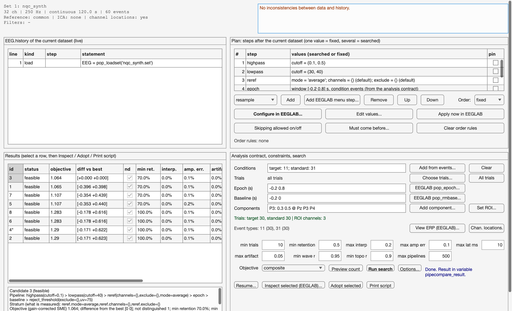

# PipeCompare

**Data-driven comparison of EEG preprocessing pipelines in EEGLAB.**

[](https://github.com/abwoo/PipeCompare/actions/workflows/matlab-tests.yml)


[](LICENSE)

PipeCompare is an EEGLAB plugin that answers a common question in EEG analysis: *which
preprocessing choices give the most precise measurement for these data?* You specify which steps
and parameter values are open to choice. PipeCompare runs every admissible pipeline through
EEGLAB's own functions, discards pipelines that violate constraints or distort a known signal, and
ranks the rest by the **standardized measurement error (SME)** of your measure (Luck et al., 2021).
The recommended pipeline is returned as a new EEGLAB dataset and as a runnable script.

The comparison never uses an experimental effect (condition differences, p-values), so selecting a
pipeline does not bias the statistical test you run afterwards.



*Formerly NeuroQC (versions up to 0.7.1); see [CHANGELOG.md](CHANGELOG.md) for migration notes.*

## Contents

- [Features](#features)
- [Requirements](#requirements)
- [Installation](#installation)
- [Quick start](#quick-start)
- [Scripting interface](#scripting-interface)
- [How a pipeline is chosen](#how-a-pipeline-is-chosen)
- [Outputs](#outputs)
- [Limitations](#limitations)
- [Testing](#testing)
- [Documentation](#documentation)
- [Citation](#citation)
- [License](#license)

## Features

- **Works on the dataset you have open.** Reads the current EEGLAB state (continuous or epoched
  data, channel locations, ICA decomposition, reference, sampling rate) and parses `EEG.history`,
  so earlier processing is taken into account.
- **ERP and band-power measures.** Mean amplitude, peak amplitude and peak latency for event-related
  data. Log band power for continuous recordings such as resting state.
- **Presets for common analyses.** ERP CORE parameters (Kappenman et al., 2021) for N170, MMN,
  N2pc, N400, P3, LRP and ERN, and standard delta, theta, alpha and beta bands.
- **User-defined search space.** Choose the steps and their order, fix some values and let others
  vary, allow steps to be skipped. Any EEGLAB menu operation, plugins included, can be added as a
  step and configured in its own EEGLAB dialog.
- **Exhaustive search.** Every admissible pipeline is run, with shared leading steps computed only
  once. The search is never sampled or truncated.
- **Signal-preservation check.** A known signal is carried through every pipeline with exactly the
  same data-driven decisions (rejected epochs, removed components, ASR reconstructions). Pipelines
  that distort it are excluded.
- **Statistically controlled ranking.** A paired bootstrap with simultaneous intervals identifies
  the pipelines that cannot be distinguished from the best, controlling the error rate across all
  candidates.
- **Reproducible output.** Each candidate's full list of EEGLAB commands, an exportable script, and
  adoption as a new dataset whose `EEG.history` reproduces it.
- **Practical for long searches.** A progress window that can stop a search and keep the finished
  pipelines, checkpointing and resume, and optional parallel execution.

## Requirements

| Component | Requirement |
|---|---|
| MATLAB | R2026a (tested). GNU Octave is not supported: the interface uses `uifigure`. |
| EEGLAB | 2026.0.0 (tested), started with its main window (not `eeglab nogui`) |
| EEGLAB plugins | firfilt (bundled with EEGLAB); ICLabel for IC removal; clean_rawdata for ASR |
| Optional | Parallel Computing Toolbox, for parallel execution; Signal Processing Toolbox, for ASR at sampling rates other than 100, 128, 200, 256, 300, 500 and 512 Hz |

Other MATLAB and EEGLAB versions have not been tested. PipeCompare reads the current dataset from
EEGLAB's base-workspace variables `EEG`, `ALLEEG` and `CURRENTSET`, and stores adopted pipelines
there.

## Installation

**From a release (recommended)**

1. Download `PipeCompare<version>.zip` from the
   [Releases](https://github.com/abwoo/PipeCompare/releases) page.
2. Unzip it into `eeglab/plugins/`. The folder must be named `PipeCompare` or
   `PipeCompare<version>`, because EEGLAB takes the plugin's name and version from the folder name.
3. Start or restart EEGLAB. The menu **Tools > PipeCompare** appears.

If you used NeuroQC before, remove the old `NeuroQC` folder from `eeglab/plugins/`.

**From source**

```bash
git clone https://github.com/abwoo/PipeCompare.git
```

Either copy the cloned folder into `eeglab/plugins/` as above, or keep it elsewhere and register
it with the running EEGLAB:

```matlab
eeglab                                    % start EEGLAB first
pipecompare_setup                         % run from the PipeCompare folder
```

`pipecompare_setup` adds the menu to the running EEGLAB session only. Run it again after each
`eeglab` call, because EEGLAB rebuilds its menus.

## Quick start

### From the EEGLAB menu

1. Load a dataset in EEGLAB.
2. Open **Tools > PipeCompare > Compare pipelines…**
3. Choose:
   - the data type: event-related or continuous;
   - the measure: an ERP component and the event types it is time-locked to, or a frequency band;
   - the recipe: which steps to compare.

   | Recipe | Steps compared |
   |---|---|
   | Filters only | high-pass and low-pass cutoffs |
   | Standard | filters, ICLabel threshold for removing components, epoch-rejection threshold |

   *Standard* detects bad channels once and fits ICA once, before the filters, so every filter
   setting shares one decomposition. The dialog shows how many pipelines will run before you
   start. Steps the data cannot support are left out, with the reason; for example, interpolation
   and ICLabel require channel locations. To compare ASR (artifact subspace reconstruction) or
   other steps, use the advanced panel or a script.
4. Press **Run**. A progress window shows how many pipelines are done and the time left; **Stop**
   ends the search and keeps the pipelines already finished.
5. The result window says which pipeline to use and why. **Use this pipeline** stores it as a new
   EEGLAB dataset; **Save script…** writes it as a MATLAB function; **Details…** opens the full
   result table.

For custom time windows and regions of interest, any EEGLAB step, order search or different
constraints, open **Advanced…** in the dialog, or **Tools > PipeCompare > Advanced panel…**. See
[docs/PANEL.md](docs/PANEL.md) for a description of every control.

### From the command line

The menu dialog records an equivalent command in EEGLAB's command history (`ALLCOM`):

```matlab
% ERP: compare pipelines for the P3, one condition per event type
EEG = pop_pipecompare(EEG, 'measure', 'P3', 'events', {'target', 'standard'}, 'recipe', 'standard');

% Continuous data: compare pipelines for alpha-band power in 2 s segments
EEG = pop_pipecompare(EEG, 'measure', 'alpha', 'recipe', 'filters');
```

Replace `'target'` and `'standard'` with the event types in your dataset. The dataset is returned
unchanged, and the result is also stored in the base-workspace variable `pipecompare_result`. Type
`help pop_pipecompare` for all options.

## Scripting interface

For full control, describe what is measured (an analysis *contract*) and what may vary (a *plan*):

```matlab
pipecompare.PipeCompare.state();          % summary of the current dataset and its history

% What is measured: conditions, epoch, baseline, and the measure (window, channels, type)
c = pipecompare.eval.Contract( ...
    'conditions', {'target', {'target'}; 'standard', {'standard'}}, ...
    'epoch',      [-0.2 1.0], ...
    'baseline',   [-0.2 0], ...
    'components', {'P3', [0.30 0.60], {'Pz', 'CPz', 'POz'}, 'mean'});

% What may vary
p = pipecompare.plan.Plan();
p = p.add('highpass');                                   % searched over the default values
p = p.add('lowpass', 'cutoff', 30);                      % fixed value
p = p.addEeglab('EEG = pop_reref(EEG, []);', 'reref');   % any EEGLAB command as a step
p = p.add('ica', 'fitHighpass', 1);
p = p.add('icremove', 'threshold', {0.8, 0.9});          % searched over two values
p = p.add('epoch');                                      % windows come from the contract
p = p.add('baseline');
p = p.add('reject_threshold', 'uv', {100, 150});

r = pipecompare.PipeCompare.optimize(p, c, struct('checkpoint', 'pc_run1'));

pipecompare.PipeCompare.adopt(r);                          % recommended pipeline -> new dataset
pipecompare.PipeCompare.writeScript(r, 3, 'pipeline3.m');  % candidate 3 as a MATLAB function
r = pipecompare.PipeCompare.resume('pc_run1');             % continue an interrupted search
```

Band power of continuous data uses the same plan with a band-power contract:

```matlab
c = pipecompare.eval.Contract('analysis', 'bandpower', 'segment', 2, ...
    'bands', {'alpha', [8 12], {'O1', 'Oz', 'O2'}});
```

By default, steps run in the order they were added. If that order is invalid, PipeCompare lists
the conflicts instead of rearranging the steps. Set `p.OrderMode = 'search'` to compare every
valid order; `p.pin(id)` keeps a step in place and `p.before(a, b)` constrains two steps.

The available steps are listed in [docs/COVERAGE.md](docs/COVERAGE.md). Search options (for
example `parallel`, `checkpoint` and `maxLeaves`) are documented in `help pipecompare.run.Executor`,
and constraints and ranking options in `help pipecompare.eval.Rank`.

## How a pipeline is chosen

1. **Feasibility.** Pipelines that fail or violate a constraint are excluded, each with a stated
   reason. Default constraints:
   - at least 10 trials and 50 % retention per condition;
   - at most 20 % of channels interpolated;
   - preservation of the known signal: amplitude error ≤ 10 %, peak shift ≤ 10 ms, artifactual
     deflection ≤ 5 %, waveform correlation ≥ 0.95, topography correlation ≥ 0.90.
2. **Precision.** Feasible pipelines are scored by their SME, divided by the gain each pipeline
   applies to the known signal. This makes the comparison one of signal-to-noise ratio, so a
   pipeline cannot appear more precise just by attenuating everything (Zhang, Garrett & Luck,
   2024).
3. **Uncertainty.** A paired bootstrap over trials, with simultaneous intervals across all pairs
   of candidates (White, 2000; Romano & Wolf, 2005), finds the set of pipelines that the data
   cannot distinguish from the best.
4. **Recommendation.** Within that set, PipeCompare recommends the least aggressive pipeline: the
   one with the highest trial retention, then the least signal distortion.

Pipelines that differ in something that changes the measured quantity, such as the reference, are
ranked separately and never compared with each other. A multiverse summary reports how much each
choice affects each measure; it is descriptive and not used in the ranking. The full derivations
are in [docs/METHODS.md](docs/METHODS.md).

## Outputs

- A ranked table of all pipelines: status, objective, confidence interval, trial retention,
  interpolation, signal-check results, and the reason for each exclusion.
- The recommended pipeline and why it was chosen.
- The full EEGLAB command sequence for every candidate.
- A standalone MATLAB function that reproduces a chosen candidate (`writeScript`).
- Adoption of a candidate as a new EEGLAB dataset whose `EEG.history` replays it (`adopt`).

## Limitations

- **The analysis contract is fixed by you.** Event types, epoch and baseline windows, regions of
  interest and measurement windows define what is measured, and are never searched.
- **The signal check is necessary, not sufficient.** The known signal has an assumed topography
  centred on the region of interest. Real components may be affected differently.
- **Some steps are re-run on the signal copy.** EEGLAB commands that make their own data-driven
  decisions, other than the built-in steps, mark-and-remove workflows and ASR, are re-run on the
  copy carrying the known signal rather than replayed. The result flags these.
- **Channel locations are needed** for spherical interpolation and ICLabel. Without them those
  steps are excluded before the search, with the reason.
- **Peak latency is a weak criterion.** Its precision is hard to estimate with few trials, so it
  rarely separates pipelines; mean-amplitude measures are more informative.
- **Computation cost.** Every pipeline also runs on the signal copy, roughly doubling the EEGLAB
  computation. Memory use grows with plan depth; the expected peak is reported when it exceeds
  2 GB. Resampling early in the plan reduces both.
- **Single-dataset scope.** STUDY-level processing, time-frequency measures, connectivity and
  source analysis are not covered.

[docs/COVERAGE.md](docs/COVERAGE.md) lists every supported operation and how it has been
validated.

## Testing

```matlab
addpath(fullfile(pwd, 'tests'));
results = run_all();
```

The suite runs on synthetic data with known ground truth. It covers history parsing, plan
enumeration (checked against brute force), the statistics (validated by simulation), signal
preservation for every built-in step, end-to-end searches with resume and parallel execution, and
EEGLAB and panel integration. Continuous integration runs every suite, including those that open
windows (on a virtual display). Steps that require clicking in EEGLAB's own dialogs cannot be automated and are
listed in [tests/MANUAL_GUI_CHECK.md](tests/MANUAL_GUI_CHECK.md).

Two optional checks use your own data, which is never committed: set the environment variable
`PIPECOMPARE_REAL_SET` to a `.set` file, or run `tests/realdata_validation.m`.

## Documentation

| Document | Contents |
|---|---|
| [docs/PANEL.md](docs/PANEL.md) | The dialog and the advanced panel, control by control |
| [docs/METHODS.md](docs/METHODS.md) | Measures, statistics and signal check, with derivations and references |
| [docs/COVERAGE.md](docs/COVERAGE.md) | Supported steps and their validation status |
| [CHANGELOG.md](CHANGELOG.md) | Release history and migration notes |
| [CONTRIBUTING.md](CONTRIBUTING.md) | Bug reports, documentation fixes and tests |

## Citation

If you use PipeCompare in published work, please cite it:

```bibtex
@software{pipecompare2026,
  author  = {abwoo},
  title   = {PipeCompare: data-driven comparison of EEG preprocessing pipelines in EEGLAB},
  year    = {2026},
  version = {0.8.0},
  url     = {https://github.com/abwoo/PipeCompare}
}
```

Please also cite the methods it builds on:

- Luck, S. J., Stewart, A. X., Simmons, A. M., & Rhemtulla, M. (2021). Standardized measurement
  error: A universal metric of data quality for averaged event-related potentials.
  *Psychophysiology*, 58(6), e13793.
- Kappenman, E. S., Farrens, J. L., Zhang, W., Stewart, A. X., & Luck, S. J. (2021). ERP CORE: An
  open resource for human event-related potential research. *NeuroImage*, 225, 117465.
- Zhang, G., Garrett, D. R., & Luck, S. J. (2024). Optimal filters for ERP research I: A general
  approach for selecting filter settings. *Psychophysiology*, 61(6), e14531.

## License

PipeCompare is released under the [MIT License](LICENSE).
